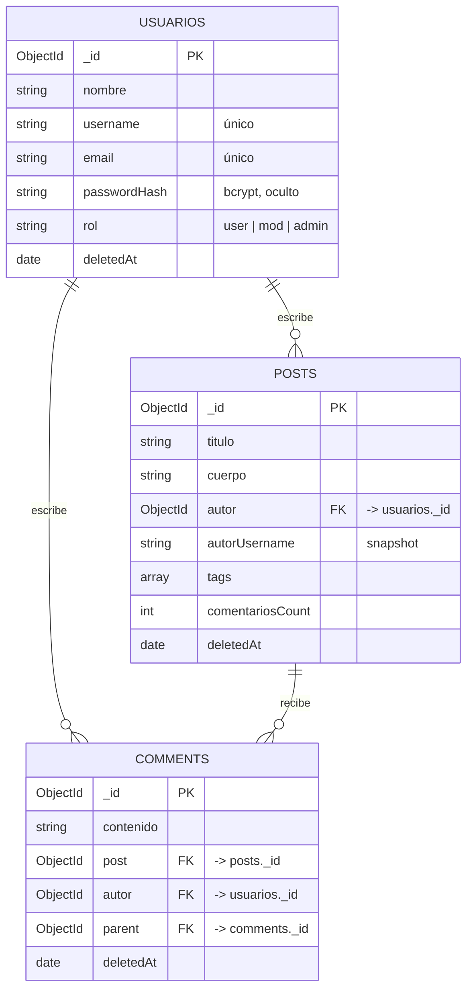

# Proyecto Foro — Base de Datos y Backend

> **Bases de Datos Avanzadas** · TIID · Grupo 5
> Integrantes: **Brian Odin Rubio V** y **Olivia Chairez Alba**
> Profesor: **Juan Carlos Herrera Hernández**

Profesor Herrera, en este documento le explicamos Olivia y Odin cómo
funciona nuestro proyecto del foro, tanto la **base de datos** como el
backend. Lo redactamos para que, al leerlo, pueda seguir la lógica del
proyecto sin tener que andar abriendo archivo por archivo, y para dejar claro el
porqué de cada cosa que decidimos.

El foro es una API REST: no tiene pantallas, solo escucha peticiones HTTP
(registrar, publicar, comentar) y responde con datos en JSON. La parte visual la
hicimos aparte, en el frontend con React. El stack que escogimos fue NestJS
como framework, Mongoose para conectar con MongoDB, y JWT con bcrypt
para la seguridad.

## Contenido

- [Parte 1 — Base de datos](#parte-1--base-de-datos)
  - [Diagrama del modelo](#diagrama-del-modelo)
  - [Colecciones y atributos](#colecciones-y-atributos)
  - [Relaciones](#relaciones)
  - [Scripts de creación e inserción](#scripts-de-creación-e-inserción)
  - [Consultas que reflejan relaciones](#consultas-que-reflejan-relaciones)
- [Parte 2 — Backend](#parte-2--backend)
  - [Cómo funciona por capas](#cómo-funciona-por-capas)
  - [El arranque](#el-arranque-maints-y-appmodulets)
  - [Los schemas (código)](#los-schemas-código)
  - [Módulo Users](#módulo-users-los-usuarios-y-el-hashing)
  - [Módulo Auth](#módulo-auth-la-parte-de-seguridad)
  - [Módulo Posts](#módulo-posts-las-publicaciones)
  - [Módulo Comments](#módulo-comments-el-que-relaciona-dos-colecciones)
  - [El recorrido de una petición](#el-recorrido-completo-de-una-petición)
  - [Lo avanzado del proyecto](#lo-avanzado-e-innovador-del-proyecto)
  - [Cómo ejecutar](#cómo-ejecutar-el-proyecto)

---

# Parte 1 — Base de datos

La base se llama `foro` y la manejamos con MongoDB, conectada desde el
backend con Mongoose. Tiene tres colecciones: usuarios, posts y
comments. La onda es sencilla: un usuario escribe publicaciones, una
publicación recibe comentarios, y cada comentario pertenece a un usuario y a una
publicación.

## Diagrama del modelo

Aqui está el diagrama (se ve renderizado en GitHub):



## Colecciones y atributos

Aquí le dejamos qué guarda cada colección. Como es MongoDB, en vez de tablas con
columnas fijas son documentos con estos campos:

### `usuarios`

| Campo | Tipo | Notas |
|---|---|---|
| `_id` | ObjectId | La clave primaria, la genera Mongo solita. |
| `nombre` | string | Requerido. |
| `username` | string | Único, en minúsculas. |
| `email` | string | Único, en minúsculas. |
| `passwordHash` | string | El hash de bcrypt. Va oculto (`select:false`). |
| `rol` | string | `user`, `mod` o `admin`. |
| `deletedAt` | date | Para el borrado suave (null = sigue activo). |
| `createdAt`, `updatedAt` | date | Automáticos, por el `timestamps`. |

### `posts`

| Campo | Tipo | Notas |
|---|---|---|
| `_id` | ObjectId | Clave primaria. |
| `titulo` | string | Requerido. |
| `cuerpo` | string | Requerido. |
| `autor` | ObjectId | **Referencia** a `usuarios._id`. |
| `autorUsername` | string | Copia del username, para no cruzar colecciones. |
| `tags` | array | Etiquetas de texto. |
| `comentariosCount` | int | Contador de comentarios. |
| `deletedAt` | date | Borrado suave. |

### `comments`

| Campo | Tipo | Notas |
|---|---|---|
| `_id` | ObjectId | Clave primaria. |
| `contenido` | string | Requerido. |
| `post` | ObjectId | **Referencia** a `posts._id`. |
| `autor` | ObjectId | **Referencia** a `usuarios._id`. |
| `parent` | ObjectId | **Referencia** a otro `comments._id` (respuestas). |
| `deletedAt` | date | Borrado suave. |

## Relaciones

Como es MongoDB y no SQL, las relaciones no van con llaves foráneas de tabla, sino
por **referencia**: un campo guarda el `_id` del documento con el que se relaciona.
Asi quedaron:

- **usuarios → posts** (uno a muchos): un usuario escribe muchas publicaciones;
  `posts.autor` apunta a `usuarios._id`.
- **posts → comments** (uno a muchos): una publicación recibe muchos comentarios;
  `comments.post` apunta a `posts._id`.
- **usuarios → comments** (uno a muchos): un usuario escribe muchos comentarios;
  `comments.autor` apunta a `usuarios._id`.
- **comments → comments** (se referencia a sí misma): un comentario puede ser
  respuesta de otro, con `comments.parent`.

Las imágenes de un post no las referenciamos, las **embebimos** dentro del mismo
post, porque son poquitas y siempre se leen junto con él.

## Scripts de creación e inserción

En la carpeta `/database` dejamos dos scripts:

- **`seed.mongodb.js`** → crea los índices e inserta registros de ejemplo (usuarios,
  posts y comentarios ya relacionados entre sí).
- **`consultas.mongodb.js`** → las consultas con relaciones (aquí abajo se las
  explicamos).

Para correr el seed, con MongoDB prendido:

```bash
mongosh "mongodb://localhost:27017/foro" seed.mongodb.js
```
## Consultas que reflejan relaciones

El formato pide mínimo dos consultas que crucen colecciones. Aquí van las dos que
hicimos, con su objetivo. Las dos usan `$lookup`, que es como el "join" de Mongo.
El código completo está en `consultas.mongodb.js`.

### Consulta 1 — Publicaciones con los datos de su autor

**Objetivo:** listar cada publicación junto con el nombre y username reales del
usuario que la escribió, uniendo `posts` con `usuarios` por la referencia `autor`.
Refleja la relación **usuarios → posts**.

```js
db.posts.aggregate([
  { $match: { deletedAt: null } },
  { $lookup: {
      from: 'usuarios',
      localField: 'autor',
      foreignField: '_id',
      as: 'autorInfo',
  }},
  { $unwind: '$autorInfo' },
  { $project: {
      titulo: 1,
      autorUsername: '$autorInfo.username',
      autorNombre: '$autorInfo.nombre',
  }},
]);
```

### Consulta 2 — Publicaciones con su número real de comentarios

**Objetivo:** para cada publicación, contar cuántos comentarios tiene de verdad
(uniendo `posts` con `comments`) y compararlo con el contador que guardamos.
Refleja la relación **posts → comments**.

```js
db.posts.aggregate([
  { $match: { deletedAt: null } },
  { $lookup: {
      from: 'comments',
      localField: '_id',
      foreignField: 'post',
      as: 'comentarios',
  }},
  { $project: {
      titulo: 1,
      contadorGuardado: '$comentariosCount',
      comentariosReales: { $size: '$comentarios' },
  }},
]);
```

---

# Parte 2 — Backend

Ya que vio cómo están los datos, ahora le explicamos el backend, que es el que
mueve todo eso. Va construido con NestJS.

## Cómo funciona por capas

Antes de entrar de lleno al código, le queremos explicar más o menos cómo funciona
el backend, porque de ahí se entiende todo lo demás. La onda es que cada petición
que llega pasa siempre por las mismas capas, en el mismo orden:

```
Guard  →  Controller  →  DTO  →  Service  →  Schema/Model  →  MongoDB
(¿pasa?)  (enruta)      (valida) (piensa)    (persiste)
```

La estructura de carpetas respeta esa misma idea:

```
src/
├── main.ts               → arranca la aplicación
├── app.module.ts         → conecta Mongo y junta los módulos
├── schemas/              → cómo se ven los datos en Mongo
└── modules/
    ├── users/            → usuarios
    ├── auth/             → login, tokens, permisos
    ├── posts/            → publicaciones
    └── comments/         → comentarios
```
## El arranque: `main.ts` y `app.module.ts`

### `main.ts`

Este es el punto de entrada; sin él no arranca nada. Aqui configuramos tres cosas
clave:

```ts
const app = await NestFactory.create(AppModule);

app.enableCors({ origin: true, credentials: true });

app.useGlobalPipes(new ValidationPipe({
  whitelist: true,            // borra props que no estén en el DTO
  forbidNonWhitelisted: true, // y rechaza si mandan de más
  transform: true,            // convierte tipos ("20" → 20)
}));

await app.listen(port);
```

Este punto es importante porque es donde más gente se traba: sin el
`ValidationPipe` global, los DTO no validan nada. Aunque tengamos un montón de
`@IsEmail()` en los DTOs, si no prendemos este pipe aquí, se los salta. El
`enableCors` es el permiso para que el frontend pueda consumir la API; sin él, el
navegador nos bloquearía las peticiones.

### `app.module.ts`

Aquí se arma el proyecto: conectamos Mongo leyendo la URL del `.env` y registramos
los cuatro módulos.

```ts
ConfigModule.forRoot({ isGlobal: true }),   // lee el .env en toda la app
MongooseModule.forRootAsync({
  inject: [ConfigService],
  useFactory: (config) => ({ uri: config.getOrThrow('MONGODB_URI') }),
}),
UsersModule, AuthModule, PostsModule, CommentsModule,
```

Aquí usamos `forRootAsync` (la versión asíncrona) en lugar de la normal, porque la
URL de Mongo viene del `.env` y se ocupa el `ConfigService` inyectado para leerla
de forma segura. Si un módulo no está registrado en este archivo, sus rutas
simplemente no existen.

## Los schemas (código)

El modelo de datos ya se lo explicamos en la Parte 1; aquí nomás le mostramos los
detalles del código de los schemas, que son las clases con las que Mongoose sabe
cómo guardar cada documento.

### `users.schema.ts`

```ts
@Schema({ timestamps: true, collection: 'usuarios' })
export class User {
  @Prop({ required: true, unique: true, lowercase: true })
  username: string;

  @Prop({ required: true, select: false })   // ← importante
  passwordHash: string;

  @Prop({ enum: ['user', 'mod', 'admin'], default: 'user' })
  rol: UserRole;

  @Prop({ type: Date, default: null })
  deletedAt?: Date | null;
}
```

### `posts.schema.ts`

El post referencia a su autor y guarda un par de cosas que decidimos anexar:

```ts
@Prop({ type: Types.ObjectId, ref: 'User', required: true })
autor: Types.ObjectId;                 // relación: apunta al usuario

@Prop({ required: true })
autorUsername: string;                 // copia del username (snapshot)

@Prop({ default: 0 })
comentariosCount: number;              // contador desnormalizado
```

### `comments.schema.ts`

Es parecido, pero referencia a DOS cosas (al post y al usuario) y tiene el `parent`
para las respuestas:

```ts
@Prop({ type: Types.ObjectId, ref: 'Post', required: true })
post: Types.ObjectId;

@Prop({ type: Types.ObjectId, ref: 'Comment', default: null })
parent: Types.ObjectId | null;         // si es null, es comentario raíz
```

## Módulo Users: los usuarios y el hashing

### `users.service.ts` — donde pusimos la lógica pesada

Este es el que de verdad trabaja. Le mostramos los dos métodos más importantes.

```ts
async create(dto: CreateUserDto) {
  const passwordHash = await bcrypt.hash(dto.password, 12);  // nunca texto plano
  try {
    return await this.userModel.create({ ...dto, passwordHash });
  } catch (error: any) {
    if (error?.code === 11000) {   // clave duplicada
      throw new ConflictException('Ya existe un usuario con ese dato.');
    }
    throw error;
  }
}
```

```ts
async findForAuth(identificador: string) {
  return this.userModel
    .findOne({ deletedAt: null, $or: [{ username: valor }, { email: valor }] })
    .select('+passwordHash')   // lo pedimos explícito porque está oculto
    .exec();
}
```

Aceptamos username o email en el mismo campo (con el `$or`), y con
`.select('+passwordHash')` traemos el hash que normalmente está escondido. También
hicimos un `softDelete` (que marca `deletedAt` en vez de borrar) para no dejar
posts ni comentarios huérfanos.

### `users.controller.ts` — solo enrutado

El controlador nomás recibe y delega. Le mostramos cómo protegimos una ruta de
administrador:

```ts
@Get()
@UseGuards(JwtAuthGuard, RolesGuard)   // primero autentica, luego valida el rol
@Roles('admin')
list() { return this.usersService.list(); }
```

Pusimos dos guards en orden: el primero revisa que la petición traiga un token
válido, y el segundo que el usuario sea admin. En el update y el delete metimos un
control de propiedad: solo el propio usuario (o un admin) puede modificar su
perfil; si no, respondemos `403`.

## Módulo Auth: la parte de seguridad

Este es el módulo más completo, y es donde está lo que consideramos la
implementación avanzada del proyecto.

### La estrategia JWT: `jwt.strategy.ts`

Esta clase define cómo validamos un token que llega. Passport ya verifica la firma
y la expiración; nosotros, además, confirmamos que el usuario siga existiendo:

```ts
async validate(payload: JwtPayload) {
  const user = await this.usersService.findById(payload.sub);
  return { id: user._id, username: user.username, rol: user.rol };
}
```

Decidimos releer el usuario de la base en cada petición, en lugar de confiar en el
rol que trae el token. Asi, si a alguien lo ascendemos a admin en Mongo, el cambio
pega de inmediato sin tener que volver a iniciar sesión. Lo que retornamos aquí
queda disponible en `req.user`.

### Los guards y decoradores

- `JwtAuthGuard` es cortito: dispara la estrategia JWT. Si no hay token o está
  inválido, responde `401` solito.
- `RolesGuard` lee con el `Reflector` qué roles pide el endpoint (los que marcamos
  con `@Roles('admin')`) y los compara con el rol del usuario. Si no coincide, `403`.
- `@Roles('admin')` y `@CurrentUser()` son decoradores que hicimos nosotros para
  que el código quede más limpio: uno etiqueta el endpoint con los roles
  permitidos, y el otro saca el `req.user` sin escribirlo a mano en cada método.

### `auth.service.ts` — el login

Aquí metimos un detalle de seguridad que queremos resaltar:

```ts
async login(dto) {
  const user = await this.usersService.findForAuth(dto.identificador);
  if (!user) throw new UnauthorizedException('Credenciales inválidas.');

  const ok = await this.usersService.verifyPassword(dto.password, user.passwordHash);
  if (!ok) throw new UnauthorizedException('Credenciales inválidas.');  // mismo mensaje

  return this.buildAuthResponse(user);   // firma y devuelve el token
}
```

Usamos el mismo mensaje de error tanto si el usuario no existe como si la
contraseña está mal. Lo hicimos a propósito: si respondiéramos "ese correo no
existe", un atacante podría ir descubriendo qué correos están registrados. Eso se
conoce como evitar la enumeración de usuarios.

## Módulo Posts: las publicaciones

Lo importante está en cómo creamos un post:

```ts
async create(dto: CreatePostDto, autor: AuthenticatedUser) {
  return this.postModel.create({
    ...dto,
    autor: new Types.ObjectId(autor.id),
    autorUsername: autor.username,   // tomado del token, no del body
  });
}
```

Esta es una decisión de seguridad que le queremos subrayar: **el autor lo tomamos
del token, nunca del body**. Aunque alguien mande `"autor": "otro-id"` en la
petición, lo ignoramos (el `whitelist` lo borra) y usamos el del token. Si lo
sacáramos del body, cualquiera podría publicar en nombre de otro usuario. También
hay un `assertOwnership` para que solo el dueño (o un admin) pueda editar o borrar
su post.

## Módulo Comments: el que relaciona dos colecciones

Este es el módulo más interesante en lo técnico, porque es el único que trabaja
con dos colecciones a la vez. Al crear un comentario pasan tres pasos:

```ts
async create(postId, dto, autor) {
  await this.postsService.findOne(postId);        // 1. verificamos que el post exista
  const comment = await this.commentModel.create({ ... }); // 2. creamos el comentario
  await this.postsService.incrementComentarios(postId);    // 3. subimos el contador
  return comment;
}
```

Por eso el `CommentsModule` importa al `PostsModule`: ocupamos el `PostsService`
para actualizar ese contador con `$inc`, que es una operación atómica. Le comentamos
con honestidad que son dos operaciones separadas (crear y contar); para hacerlas
100% atómicas necesitaríamos una transacción con replica set, pero para el alcance
de este proyecto el `$inc` cumple bien.

## El recorrido completo de una petición

Para amarrar todo, así funciona cuando alguien publica (`POST /posts`):

1. Llega la petición con el token en el header y `{ titulo, cuerpo }` en el body.
2. El `JwtAuthGuard` revisa el token. Si está inválido, responde `401`.
3. El `ValidationPipe` valida el body contra el `CreatePostDto`. Si falta el
   título, responde `400`.
4. El controller saca el usuario del token con `@CurrentUser()` y le pasa la
   bola al service.
5. El service crea el documento con el autor del token y lo guarda con el
  modelo de Mongoose.
6. Mongo lo persiste y devuelve el post con su `_id`.

Seis pasos, cinco capas. Ese mismo recorrido aplica a todas las rutas; solo cambian
los nombres.

## Lo avanzado e innovador del proyecto

Le queremos destacar los puntos que consideramos el valor agregado:

- **Autenticación JWT completa**: hashing con bcrypt, tokens firmados, guards y
  roles. Es la característica que no vimos en clase.
- **Soft delete**: no borramos registros físicamente, los marcamos con
  `deletedAt`, conservando la integridad de las relaciones.
- **Desnormalización con criterio**: el `autorUsername` y el `comentariosCount`
  nos evitan cruzar colecciones en los listados.
- **Manejo de errores cuidado**: traducimos el 11000 a un 409, y usamos el mismo
  mensaje en credenciales para no filtrar información.

## Cómo ejecutar el proyecto

```bash
# Base de datos (con MongoDB prendido)
mongosh "mongodb://localhost:27017/foro" database/seed.mongodb.js

# Backend
npm install                # instala dependencias
cp .env.example .env       # y ajustamos el JWT_SECRET
npm run start:dev          # arranca en http://localhost:3000
```

Ocupa MongoDB corriendo (local o Atlas) y el `.env` con la `MONGODB_URI`, el
`JWT_SECRET` y el `JWT_EXPIRES_IN`.

---

Profesor, esa es toda la maquinaria del proyecto, de la base de datos hasta el
backend. La idea que quisimos lograr es que, entendiendo las cinco capas y sabiendo
ubicar en cuál pasa cada cosa, el proyecto se entienda por completo; lo demás es el
mismo patrón repetido cambiando los nombres. Quedamos atentos a cualquier pregunta
o modificación que nos quiera pedir sobre el código.
